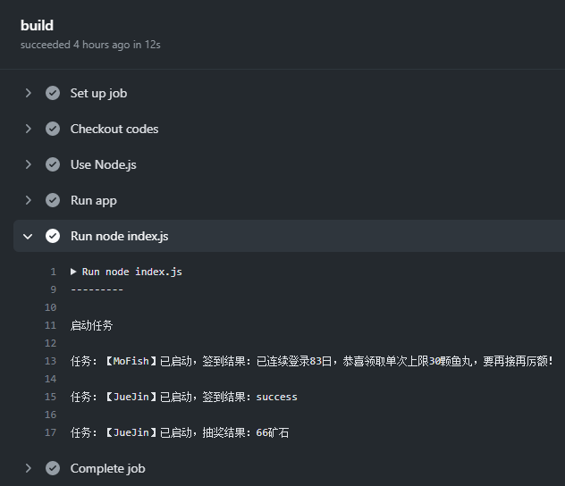

# 定时签到，Github Actions 版（暂时屏蔽 Server 酱推送功能）

## 运行结果

## 前置条件
需要相对应项目的 token 以及用于推送的 Server 酱的 token（不用也行，后续再添加）

## 配置
Fork 本项目

在项目页面中 Settings —— Secrets 点击 `New secret` 添加一下信息：

      MO_FISH_USERNAME
      MO_FISH_PASSWORD
      JUE_JIN_COOKIE
      SERVER_J

## `token` 获取方式：
### MO_FISH_USERNAME、MO_FISH_PASSWORD
- [mo.fish 鱼塘热榜](https://mo.fish/) 的账号及密码

### JUE_JIN_COOKIE
- [掘金](https://juejin.cn/) 登陆后的 Cookie
### SERVER_J
- server酱的 token
- 去 [Server酱](http://sc.ftqq.com/?c=code) 获取 `SCKEY`

## 运行
### 启动 Actions
   - 点击项目功能栏的 Action
   - 点击绿色按钮进行激活

### 自动运行
启动 Actions 后，会自动运行，具体触发条件：
   - 每次 commit 后会自动运行
   - 默认每天 08:05 运行

剩下的具体看 `.github/workflows/main.yml`

## TODO
- [x] mo.fish 鱼塘热榜签到
- [x] JueJin 掘金签到
- [x] JueJin 掘金抽奖
- [ ] 默认不推送签到结果，报错后发送新版 Server 酱

## QA
1) 待定
